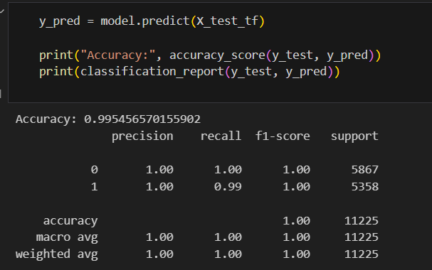

# 📰 Fake News Detection using Passive Aggressive Classifier

This project uses NLP + machine learning to detect whether a news article is fake or real.  
Built with TF-IDF vectorization and PassiveAggressiveClassifier.

## 📂 Files
- `fake_news_detector.ipynb` - Main notebook
- `model.pkl` - Trained ML model
- `vectorizer.pkl` - TF-IDF vectorizer
- `requirements.txt` - Python dependencies
- [fake-and-real-news-dataset](https://www.kaggle.com/datasets/clmentbisaillon/fake-and-real-news-dataset/data) 

## 🚀 How to Run
1. Clone this repo
2. Install dependencies: `pip install -r requirements.txt`
3. Run the notebook

## ⚙️ ML Pipeline
- TF-IDF Vectorizer
- PassiveAggressiveClassifier
- Accuracy: 99.5%

